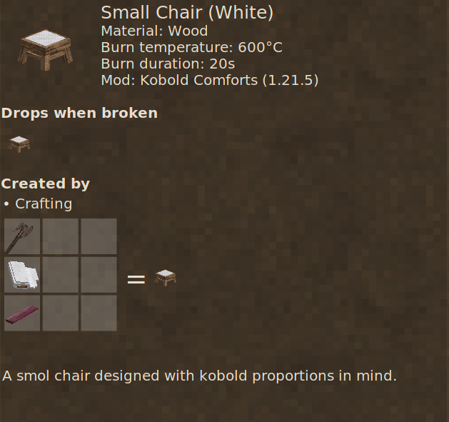
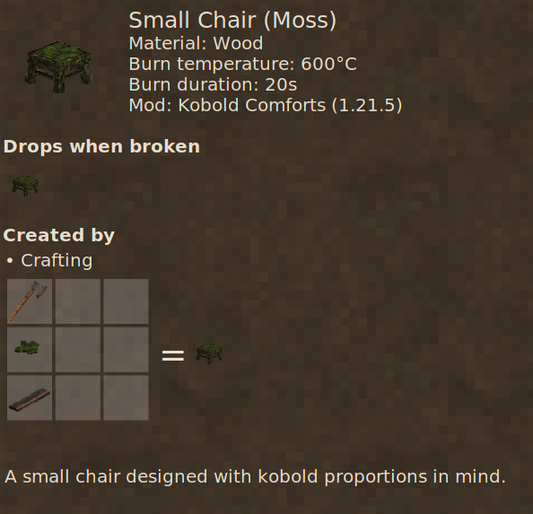
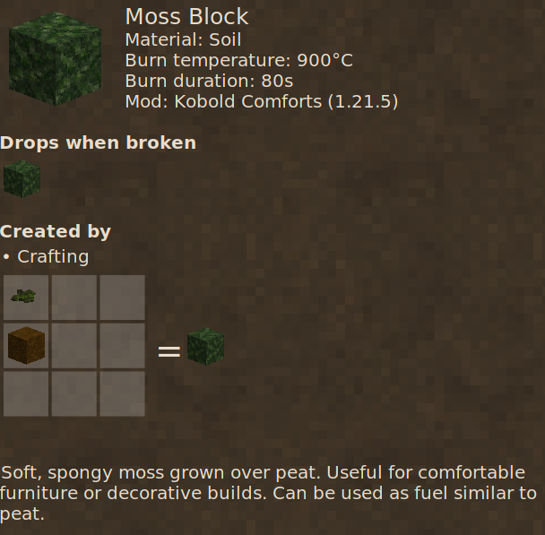

# Kobold Comforts Mod

This is a Vintage Story content mod for short kobolds!

**Highly recommended**: To actually fit your player character through the 1-block-tall doors, use the [Kobold Player Model Redux](https://mods.vintagestory.at/koboldrdx) mod and set your character height to 50% or less. Kobold Comforts itself has no hard dependencies.

## Mod Information

- **Mod ID**: `koboldcomforts`
- **Name**: Kobold Comforts
- **Version**: 1.0.0
- **Authors**: Zynth
- **Game Version**: 1.21.5
- **Type**: Content Mod

## Description

Only another kobold truly understands how difficult life can be when you are smol. Bigfolk build everything too tall and too wide, and every home feels like it was made for giants.

This mod focuses on smol friendly comforts that make the world feel sized for kobolds again. It adds compact doors perfect for smol kobolds, house pets, and scurrying critters, with full door functionality, including locking and support for various wood types.

Unlike gates and fences, these doors block light and create valid "Rooms" in Vintage Story, making them perfect for building proper kobold-sized homes.

The mod is meant to grow over time with even more kobold sized comforts.

## Features

- Small doors suitable for smallest kobolds!
  - Full door functionality
  - Craftable from any wood type (probably)
  - Blocks light and creates valid "Rooms" in Vintage Story (unlike stinky gates and fences)
- Small chairs!
  - Many colors
- Moss blocks!
  - Soft, spongy moss grown over peat
  - Perfect for comfortable furniture or decorative builds
  - Grow moss culture in a barrel from rot and water, then craft moss blocks

## Localization

The mod supports the following languages:

- English (en)
- German (de)
- French (fr)
- Spanish (es)
- Danish (da)
- Norwegian (no)
- Swedish (sv)

## Manual Installation

1. Download the mod from [mods.vintagestory.at](https://mods.vintagestory.at/koboldcomforts)
2. Place the downloaded zip file directly in your Vintage Story `Mods` directory (no need to unpack)
3. Launch the game and enable the mod

## Dependencies

- **Hard dependencies**: None.
- **Optional but highly recommended**: [Kobold Player Model Redux](https://mods.vintagestory.at/koboldrdx) if you want your player character to be small enough to use the 1-block-tall doors.

## Crafting

### Small Door

A totally _normal_ wooden door (for Kobolds).

### Small Chair

Small chair! Or should I say normal chair? It is the other chairs that are too big!

#### Small Chair with Moss!

Smells fresh (but don't eat it)!

### Moss Culture

Grow moss in a barrel! Put 8 rot and 20 liters of water in a sealed barrel, wait 5 days (120 hours), and get 32 moss culture. Very mossy! If you don't know where to store them, put the on the ground!

### Moss Block

Craft moss blocks by putting moss culture on top of peat! Makes soft, spongy moss blocks perfect for comfy builds!

## Changelog

### Version 1.1.0

**New Features:**

- Added small chair with 12 color variants (plain, blue, red, yellow, purple, brown, green, orange, black, gray, pink, white)
- Added moss block - soft, spongy moss grown over peat, perfect for comfortable furniture or decorative builds
- Added moss culture - grow moss in a barrel from rot and water, then use it to craft moss blocks

**Fixes:**

- Small doors now play sounds correctly when opened and closed
- Small doors now have proper sound effects when placed, hit, or broken
- Small door recipe is now simpler and easier to craft (same recipe, more flexibility in grid placement)
- Small doors translation use "Kobold" and "Kobolds" regardless of language

### Version 1.0.0

- Initial release
- Added small doors for all wood types
- Full door functionality (open/close, lockable)
- Reinforceable door
- Blocks Light (Usable to create valid "Rooms" in Vintage Story)
- Multi-language support (en, de, fr, es, da, no, sv)

## License

See [LICENSE](LICENSE) for full license details.

**TLDR**: Code is licensed under MIT License. Assets (textures, models, icons, sounds, artwork) are licensed under CC BY-SA 4.0.
